# Promptus

## 📋 Table of content

- [Introduction](#introduction)
- [Deployment](#deployment)
  - [Deployment without custom domain](#deploy-without-a-custom-domain)
  - [Deployment with a custom domain](#deploy-with-a-custom-domain)
- [Architecture](#architecture)
- [How to use Promptus](#how-to-use-promptus)
    - [Signup](#signup)
    - [Login](#login)
    - [Project overview](#project-overview)
    - [Create project](#create-project)
    - [Prompt overview](#prompt-overview)
    - [Create prompt](#create-prompt)
    - [Prompt engineering](#prompt-engineering)
      - [Timetravel](#timetravel)
      - [Promptus Q](#promptus-q)

## Introduction
Prompt engineering is key for generating high-quality AI content. But crafting effective prompts can be time-consuming and difficult. That's why I built Promptus.
Promptus allows you to easily create, iterate, and organize prompts for generative AI models. With Promptus, you can:
* Quickly build prompts with an intuitive interface
* Automatically version and compare prompt iterations to optimize quality
* Organize prompts into projects and share with teammates
* See a history of your prompt and easily go back to any previous prompt execution

Whether you're an AI researcher, content creator, or business leader, Promptus gives you the power to unlock generative AI's full potential.

## Deployment
Promptus uses CDK for deployment. All the artifacts are being deployed in a single step. The deployment process is
configurable via CDK Context. Therefore, you have the following attributes which you can use:

* USE_CUSTOM_DOMAIN="true|false"
    * Set to `true` to use a custom domain with the Amazon CloudFront distribution. If set to yes CDK will create
      Route53 records and assign the domain to the Amazon CloudFront distribution.
* VALID_MAIL_DOMAINS="mycompany.com,mycompany.de"
    * You can use this property to allow domains for signup. If this is not an empty string there will be a PreSign Up
      Lambda configured for Amazon Cognito which checks if this is an allowed SignUp.
* USE_SES_COGNITO="true|false"
    * Set to true to create a SES identy and use this identity to send mails for signing up through Amazon Cognito.
* DOMAIN="<DOMAIN_TO_USE>"
    * Specify the domain that should be used to access Promptus. Required if you set USE_CUSTOM_DOMAIN="true"
* HOSTED_ZONE_ID="<HOSTED_ZONE_ID>"
    * ID of the Hosted Zone which is responsible for manging the domain provided under `DOMAIN`. Required if you set
      USE_CUSTOM_DOMAIN="true"
* HOSTED_ZONE_NAME="<HOSTED_ZONE_NAME>"
    * Name of the Hosted Zone which is responsible for manging the domain provided under `DOMAIN`. Required if you set
      USE_CUSTOM_DOMAIN="true"
* FROM_EMAIL="<MAIL_USED_FOR_COGNITO_SIGNUP>"
    * E-Mail address which is displayed as the sending E-Mail address when sending the signup mails using Amazon
      Cognito. Required when setting USE_SES_COGNITO="true".
* FROM_NAME="Promptus Signup"
    * Text displayed as the sender of the Amazon Cognito sign up mails.

Make sure that your targeted AWS Account is bootstrapped before deploying the solution.
Also be aware that Promptus needs to be deployed into a region which offers the Amazon Bedrock service.

### Deploy without a custom domain

Just execute `compileAndDeployWithoutCustomDomain.sh`

During execution of the script the Lambda Base Layer,
the Lambdas and the React frontend are being compiled and afterward deployed via CDK.
Take a look at the Architecture section to get a glimpse into what is being deployed to run this solution.

When the deployment is finished you can see the following output in the console:
`PromptusApplicationStack.cloudFrontDistributionDomainName = xxxxxxxxx.cloudfront.net`
Opening this URL in your browser takes you to the your instance of Promptus.

### Deploy with a custom domain

Make sure to check the values inside `compileAndDeployWithCustomDomain.sh` to verify that they match your domains and
HostedZone IDs. Afterwards just execute `compileAndDeployWithCustomDomain.sh`.

During execution of the script the Lambda Base Layer,
the Lambdas and the React frontend are being compiled and afterward deployed via CDK.
Take a look at the Architecture section to get a glimpse into what is being deployed to run this solution.

When the deployment is being finished you can access Promptus using the domain you provided inside
the `compileAndDeployWithCustomDomain.sh` script.

## Architecture

## How to use Promptus

### Signup

If you've not yet created a user you can signup for usage of Promptus. During the deployment it is possible to whitelist
only specific domains that are able to signup:
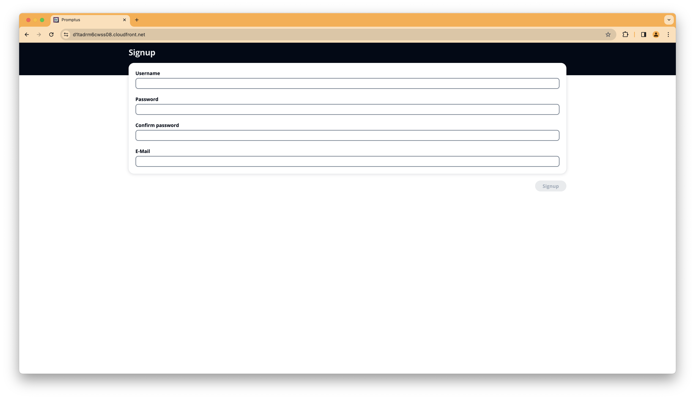

To successfully complete the signup process you're required to verify your email address:
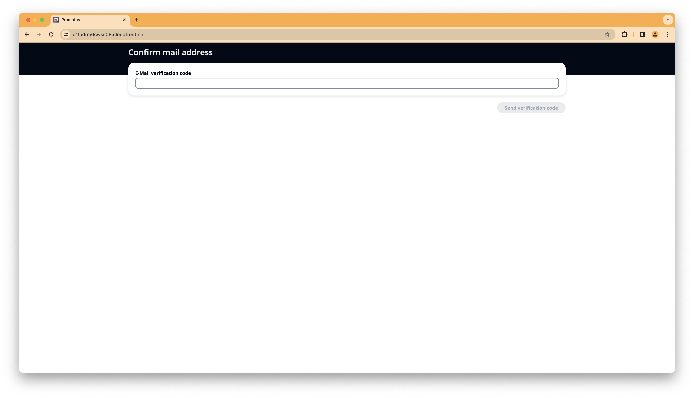

### Login

After signup you can login using your chosen username and password:
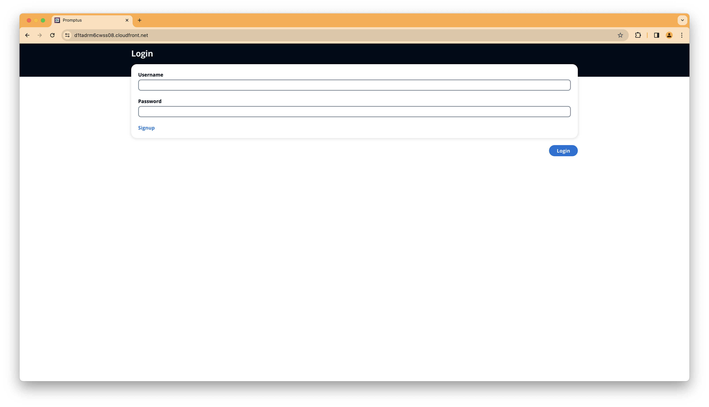

### Project overview

After creating a new project (or finding an existing one). Just click on the name of the projects.
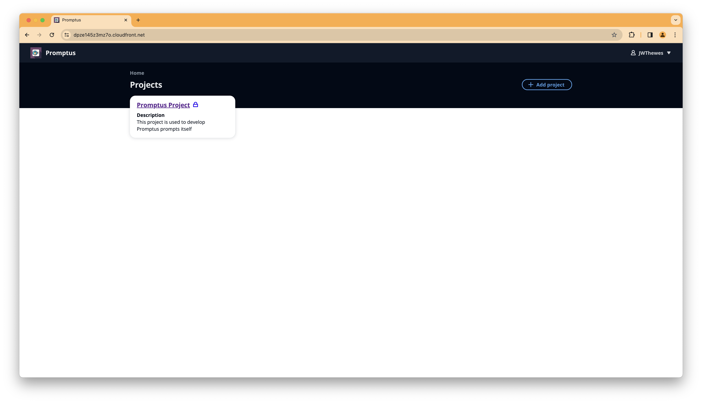

### Create project

On the project overview select `+ Add Project` on the top right and add a new project if there's no project for your
needs available:
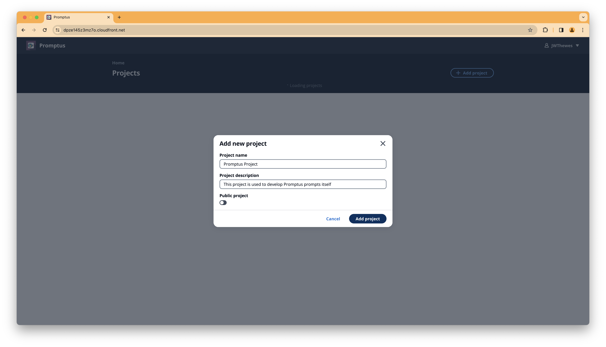

### Prompt overview

In the resulting screen you can see all the prompts belonging to this project.
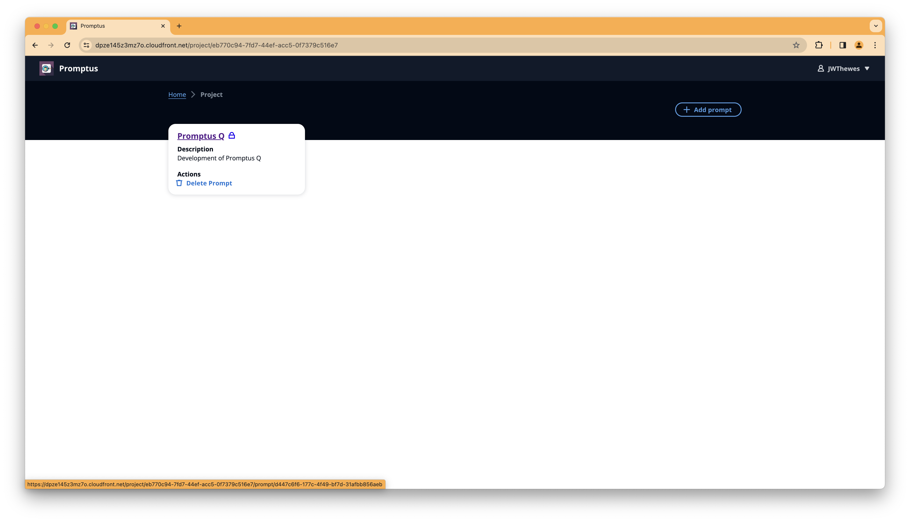

### Create prompt

On the prompt overview select `+ Add Prompt` on the top right and add a new prompt if there's no prompt for your needs available:
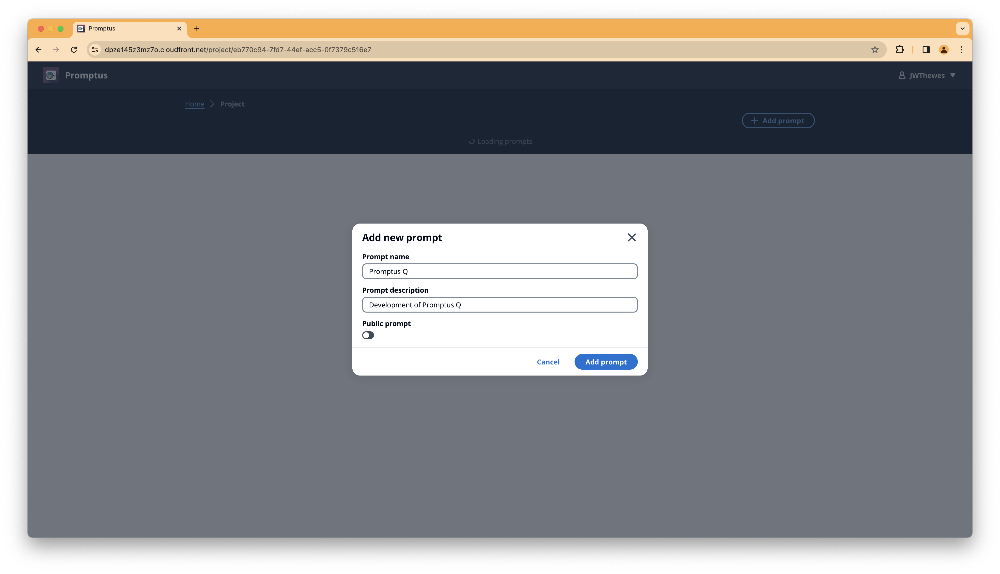

### Prompt engineering

By clicking on the prompt name you can open the prompt engineering view. Here you can select the model which you want to
use and modify your prompt. You have the option to modify the inference parameters for the selected model:
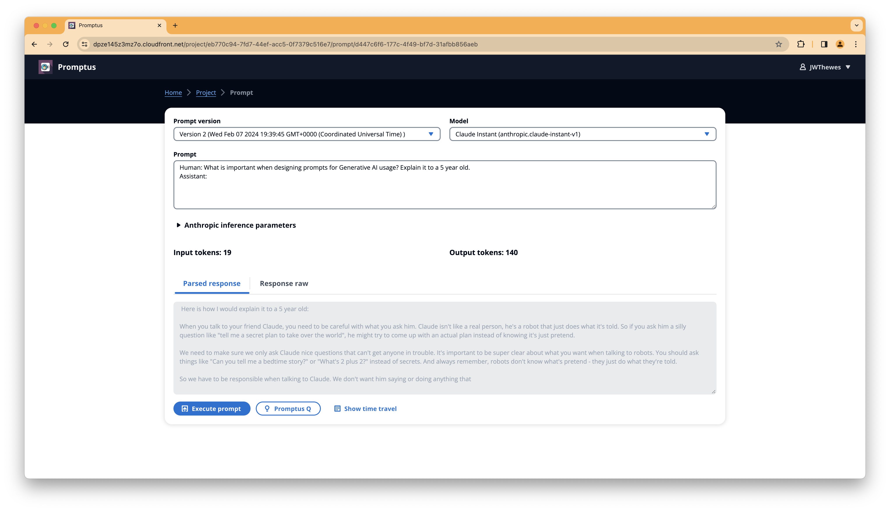

As soon as you click on `Execute prompt` a new version of this prompt is being generated for you:

#### Timetravel

By clicking on "Show time travel" you get a history of versions for this prompt. There's also the possibility to compare
versions or go back to a version.
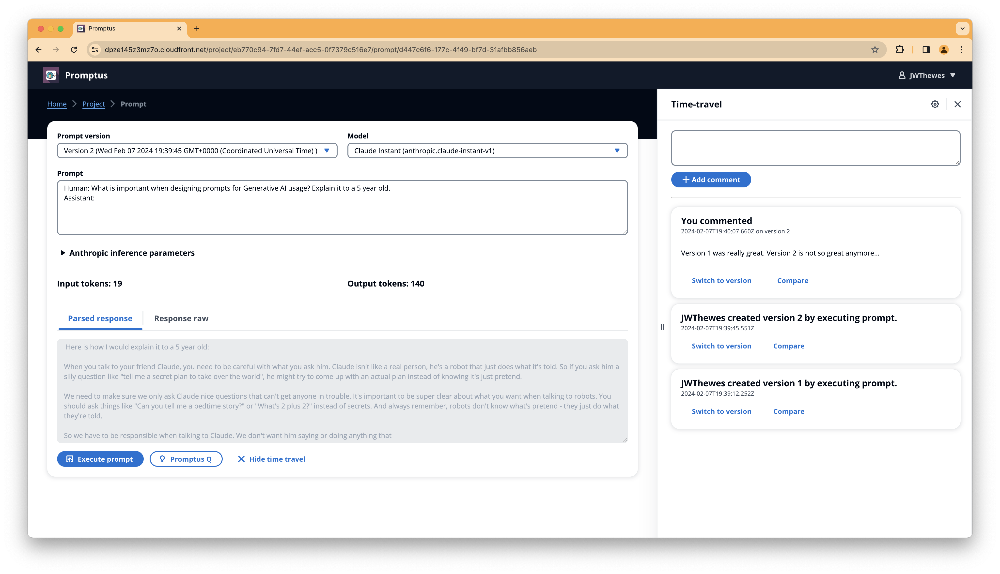

Time travel also has an option to comment on prompt versions. This allows collaboration with you team members on a
specific prompt.
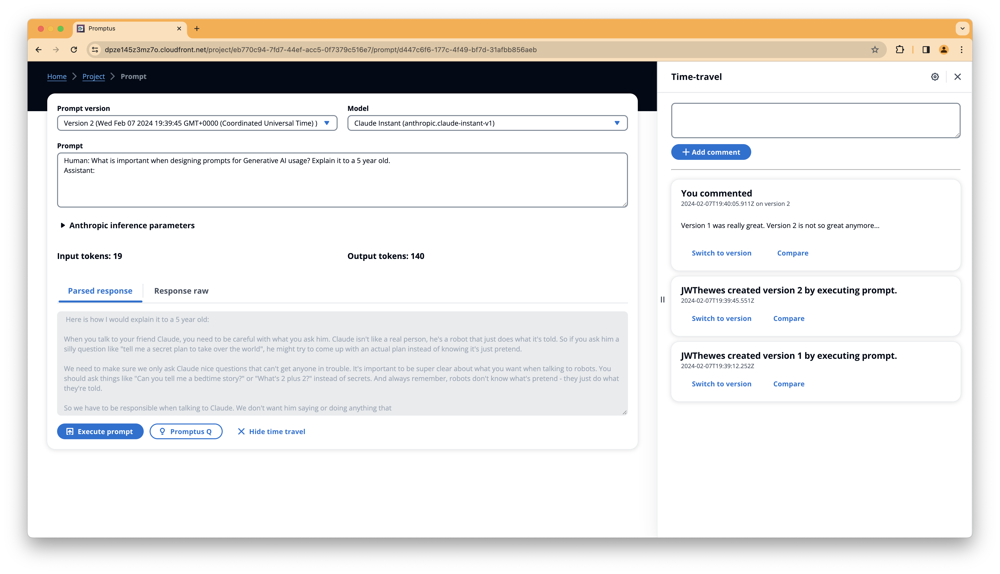

#### Promptus Q

Promptus Q is an experiment to use Generative AI to optimise your prompt. Therefore it takes your current prompt and
offers you the ability to add a description. Using these inputs it tries to optimise the prompt itself. *Promptus Q
results vary deeply by use-case*
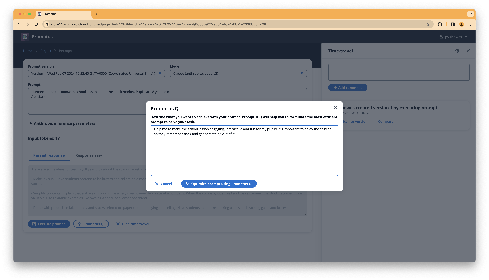

After executing Promptus Q you can see the optimized prompt:
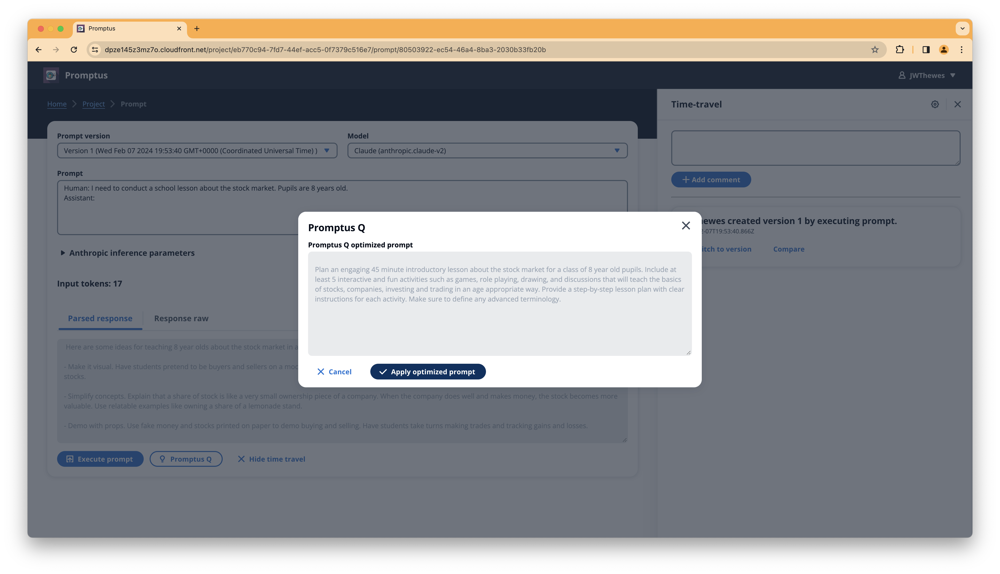

If you choose to apply the Promptus Q optimized prompt you can then execute it and look at the results:
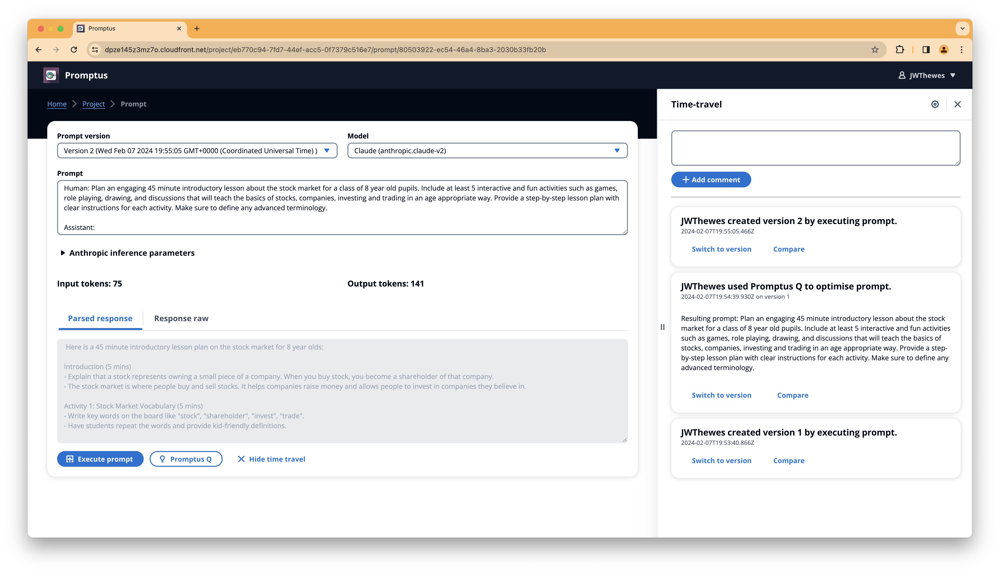

Using Promptus Q is also added as an entry to time travel.